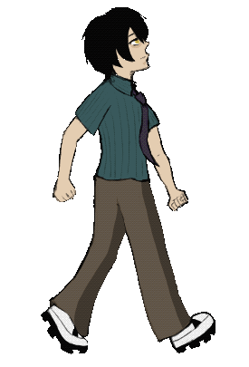
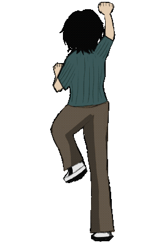

# SD-dev-portfolio
---

## Custom Game Engine (C++) / Personal Project
Unity and Unreal felt too comfortable, and since I want to know what is happening under-the-hood, I'm attempting to build a custom game engine from scratch in C++ to deepen my understanding of low-level systems programming and real-time application architecture. By this, I get to have full controls of the systems I'm working on!

- Building using the Win32 API and custom rendering loop(in-progress)
- Attempting to implement an component-based-arhitecture
- Focused on modularity and extendability for future physics and rendering systems, such as plug-ins like my physics engine
- Current milestone: Window Management, Creating Game Loop, Application and Game Object Class

[View Repository](https://github.com/SD0249/Demon-Engine)

---

## Physics Engine (C++) / Personal Project
Code Name: Faraday. 

Currently on the process of developing a Math Library like OpenGL Mathematics(GLM) comparing it to the results when run with the same value in GLM, and planning to have Fixed Update Loops, with Numerical Integrations.  
-> Since I am going to use OpenGL, I realized that it would be nicer if I learned how to use OpenGL rather than trying to study as I go.

---

## Algorithms & Systems (C#) / Academic Projects
A collection of algorithm and systems programming exercises exploring foundational CS topics.

Includes:
- Graph search algorithms (BFS, DFS)
- Sorting and Pathfinding implementations
- Data structure experiments (queues, stacks, trees)
- Designed for problem-solving and systems design understanding

Located in this repository's [Algorithms and Systems](AlgorithmsAndSystems) file

---

## Sweet Dreams (C#) / Academic Project
A Team Project with an objective to make a Top-Down Shooter game with the given time frame, adapting to Game Development Processes. Handled Drawing Start and User Interface buttons, and implemented my first camera class, which leads to my passion to understand the matrices to better understand how camera works.

[View Repository](https://github.com/SD0249/Sweet-Dreams_SugarRush)

---

## Mistique Menu (C#) / Personal Project
An on-going project for purposes to stay in-touch with my friend during the summer. At the previous project, Sweet Dreams, I have developed a Camera Class that was tied to the screen of the viewport, which was a bad design choice. Here, I worked with my friend who handled the render logic which rescales what the camera sees, and I have handled the Camera portion to only show the portion of the world, *decoupling the camera from the screen size*. That way, we were able to make the game run in full screen on any device!

However, we had to import all the work to Unity, because the MonoGame 3.8.4 was having problems with its content builder. We haven't moved much content from the old repository to the new repository yet.

[View Repository](https://github.com/SD0249/MysticMenu)

---

## Plinko (Unity - C#) / Academic Project
Here, I wanted to utilized the skills I have learned from my 2D Animation and Assets Production Class. Besides some pegs and wall sprites, I have drawn all of the sprites including the bucket(FlyTrap) and the Fly(Chip). It was a nice project to get used to Unity's Component-based System, and seeing my own animation in result was rewarding!

[Play Game in Web!](https://igme-202-2251.github.io/202-work-SD0249/Project_01/)

---

## Scream Jam 2025(GameMaker/GML) - Ticket To Terror Station
I took the role of product management and main character artist in this Game Jam, as I wanted to try some of the other responsibilities in a team development environment. Doing the main character art was fun and rewarding, and I think we made a decent progress in a week using Game Maker to make the game!

[View Repository](https://github.com/SD0249/Ticket-To-Terror-Station/tree/New-Branch)

---

## Personal Portfolio Website
A work-in-progress website for showcasing technical projects visually, write-ups, including visual demos.

[Portfolio_Website_In_Progress](https://people.rit.edu/al7798/235/project1/)

---

## Current Project Focus

**Custom Game Engine**
- Implementing a component-based architecture to handle multiple game objects efficiently
- Working on input handling and basic rendering using Win32 API

**Physics Engine**
- Building Math Library for use with visual debugger using OpenGL
- Reading free class resource files from NewCastle MS Program related to Physics Engine Design
- Priority Goal: Learn about OpenGL first instead of studying it while I build the project!

**NPC World**
- Building a simulation of a themed world using concepts of Autonomous Agents.
- Understanding and implementing Reynold's Steering algorithms to generate complex behaviors
  
---

*This Portfolio is continuously updated as new systems and features are developed.
